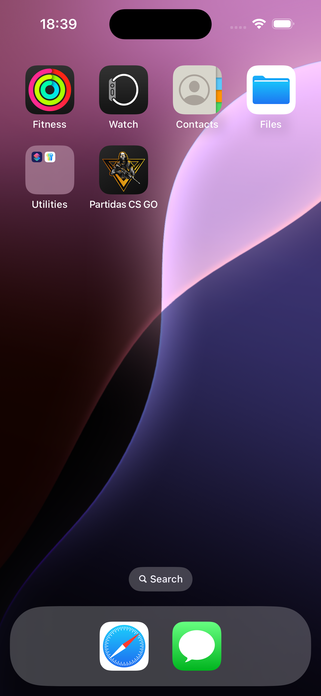
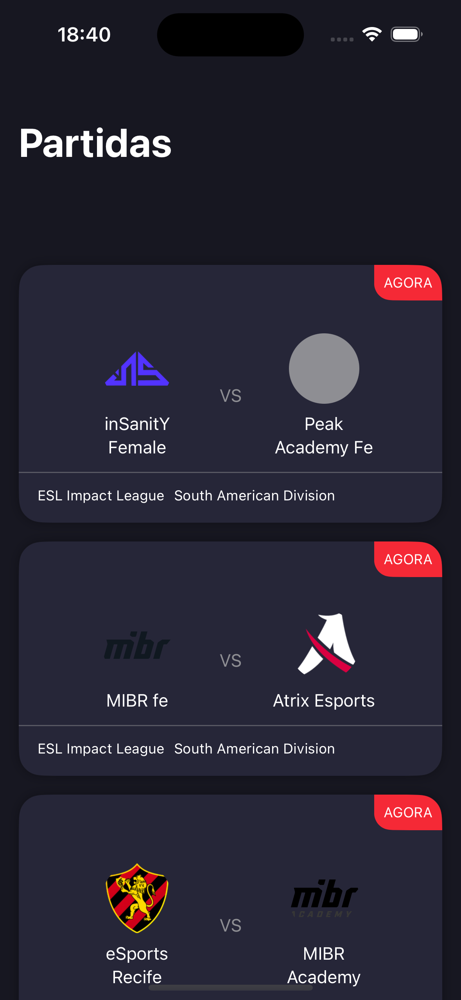
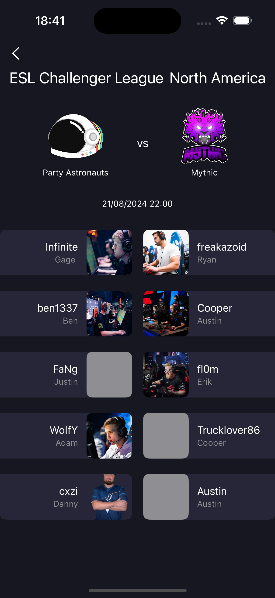

# CS:GO Matches App

CS:GO Matches is an iOS app that displays CS:GO matches happening across several worldwide tournaments. Using the PandaScore API to fetch match data.

## Screenshots

  
  
   

## How to Run

1. Clone the repository
2. Copy `development.xcconfig.example`
3. Remove the `.example` extension from the copied file
4. Add your PandaScore API key to the `API_KEY` field in `development.xcconfig`
5. Open the project in Xcode and run

## Project Structure

This project follows the MVVM (Model-View-ViewModel) architecture:

- **Models**: Represent the data structures used in the app
- **Views**: SwiftUI views that display the UI
- **ViewModels**: Handle the business logic and data processing

## HTTP Calls

We use a custom `APIService` to handle HTTP requests. This service is protocol-based, allowing for easy mocking in unit tests.

## ViewModel Usage

We demonstrate two ways of using ViewModels in SwiftUI:

1. `@StateObject` in the matches list view
2. `@EnvironmentObject` in the match detail view

This showcases different ways of managing state and passing data between views.

## Testing

The project includes unit tests for the main features, liting and show match details.

## Potential Improvements

- Enhance error handling for a better user experience.
- Implement pagination for the matches list.
- Utilize Combine or the Observation framework for more reactive programming.
- Cache images to improve UX and app performance.

## Libraries Used

This project does not use any third-party libraries. It's built entirely with SwiftUI and native iOS frameworks.
